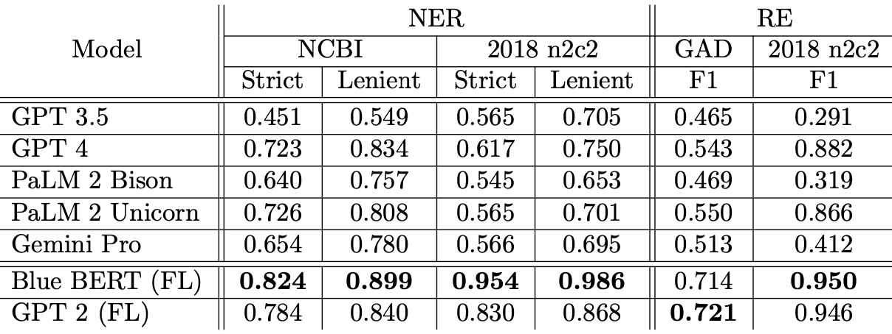

# LLM-BioMed-NER-RE

This repository contains the LLM evaluation code for the paper "*An In-Depth Evaluation of Federated Learning on Biomedical Natural Language Processing for Information Extraction*". The datasets used in this paper were downloaded from [[FedNLP Repo]](https://github.com/PL97/FedNLP). In particular, they are *NCBI-Disease*, *2018 n2c2* datasets for named entity recognition (NER); *GAD* and *2018 n2c2* for relation extraction (RE). 

Table 1: The results of LLMs with 20-shot prompting on NER and RE tasks, compared with Blue BERT and GPT 2 trained with federated learning. 

## Data
More details of the datasets can be found in [`data`](data).

## Models
| **Model** | **RLHF-Tuned** | **Instruction-Tuned**| **Max Input Tokens** | 
| :--- | :---: | :---: | :---: |
| GPT 3.5 (Chat) | Yes | No |16K |
| GPT 4 (Chat) | Yes | No |128K |
| PaLM 2 Bison (Chat) | No | No |8K |
| PaLM 2 Unicorn (Text) | No | No| 8K |
| Gemini Pro (Chat) | No | No |32K |

The models used in this paper are mostly chat models and a text-completion model without specifically tuning for NER and RE tasks. We applied in-context learning by providing examples as prompts to the models. Even with 20-shot prompting, the input tokens length is still within 8K, which all models can handle in its context window. 

The example notebooks are in the root folder.